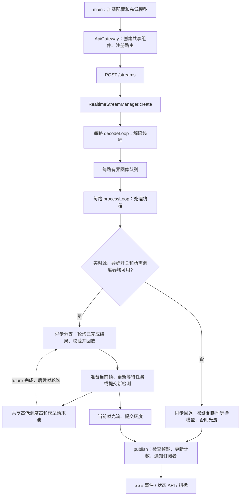

# 多路实时监测代码速读记录（2026-09-08）

阅读依据：[多路实时监测实施记录](多路实时监测实施记录_20260905.md)及当前源码（2026-09-29 同步；文件名保留首次编写日期）。本文按调用关系整理，适合先用 5 分钟建立整体认识，再按表定位代码。

**核心思路：每路独立解码、独立维护跟踪状态，共享高低模型和公平推理调度；实时源在积压时优先处理新帧，通过低频检测和帧间光流减少模型调用。**

## 1. 先看整体关系

模型和调度器按高、低两级共享，每路各有一个解码线程和一个处理线程。`StreamProcessor` 在该路处理线程内创建，保存自己的 tracker、上一帧灰度和可见轨迹；它本身不加载模型、不解码、不创建线程。

## 2. 推荐代码阅读顺序

以下路径均位于 `yolo_onnx_cpp/`。先看函数边界和调用点，再进入实现细节。

| 顺序 | 文件与重点入口 | 读完应能回答 |
| --- | --- | --- |
| 1 | [main.cpp](../../yolo_onnx_cpp/main.cpp)：`main`；[api_gateway.cpp](../../yolo_onnx_cpp/drogon/api_gateway.cpp)：构造函数、`registerRoutes` | 配置、模型、调度器、流管理器在哪里组装？哪些对象共享？ |
| 2 | [realtime_stream_handlers.cpp](../../yolo_onnx_cpp/drogon/realtime_stream_handlers.cpp)：`registerRealtimeStreamRoutes` | HTTP 如何创建、查询、停止和订阅一条流？ |
| 3 | [realtime_stream_manager.cpp](../../yolo_onnx_cpp/stream/realtime_stream_manager.cpp)：`StreamContext`、`create`、`decodeLoop`、`takeNextFrame` | 每路有哪些状态？图像如何入队、丢弃或等待？ |
| 4 | 同文件：**`processLoop` → `processAsyncSingleModel / processAsyncHighLow` 或同步回退 → `publish`** | 一帧从解码到输出经过哪些决策？这是主阅读入口。 |
| 5 | [stream_processor.cpp](../../yolo_onnx_cpp/stream/stream_processor.cpp)；[detection_cadence.h](../../yolo_onnx_cpp/stream/detection_cadence.h)：`select` | 跟踪状态怎样推进？什么时候使用高模、低模或光流？ |
| 6 | [inference_scheduler.cpp](../../yolo_onnx_cpp/model/inference_scheduler.cpp)：`submit`、`scheduleReadyLocked`、`takeNext`、`run`、`finishTask` | 多路怎样轮流使用模型？怎样限制单流并发和排队？ |
| 7 | [yolo_engine.cpp](../../yolo_onnx_cpp/model/yolo_engine.cpp)：`initOpenVino`、`inferOpenVino`、`maxConcurrency` | 如何分配、借用和归还 InferRequest？实际能同时执行几个请求？ |

第一次阅读可以暂缓大型离线视频实现、完整跟踪算法和验收脚本。需要理解双模型质量策略时，再读 [authority_tracker.h](../../yolo_onnx_cpp/tracking/authority_tracker.h) 和对应实现中的 `updateHighRes`、`updateLowRes`、`updateFlow`。

## 3. 跟着一帧读 processLoop

1. **选择处理路径。** 实时源开启 `video_model_async` 且所需调度器可用时，进入单模型或高低模型异步分支；本地文件、关闭异步或缺少所需调度器时留在同步循环。
2. **取帧并检查年龄。** `takeNextFrame` 对实时源取最新帧并清掉积压，对文件按 FIFO 读取。实时新鲜度从本地解码完成的单调时钟 `captured_at` 计算。
3. **接收旧检测。** 异步分支零等待轮询 future，验证原始 `InferenceContext{stream_id, frame_index, timestamp_ms}`、源帧年龄和回放历史；成功回放后恢复跟踪器。高低模型保留最多 60 帧回放历史，单模型最多 32 帧。过期或无法回放的结果跳过。
4. **准备当前帧。** `prepareFrame` 生成灰度、光流质量和投影，准备后再查帧龄。质量下降或权威跟踪器请求可触发高模刷新。
5. **更新或提交检测。** 每级最多保留一个 pending future；有票据且尚在队列内的任务可更新为最新帧，执行中的任务不替换。异步节奏按 `captured_at` 的实际经过时间计算，保留未到期/忙碌级别的预算；高低模型可各有一个未完成请求。
6. **推进跟踪。** 异步路径用已校正的历史状态对当前帧做光流；同步回退则在到期时在 `runModel` 内等待调度 future并直接应用检测，否则用光流。
7. **提交灰度并发布。** `finishFrame` 保存当前灰度，`publish` 再查停止与帧龄。异步事件的顶层帧号属于当前输出帧，`inference_updates` 列出本次应用的旧检测来源；不要把两者当成同一帧。
8. **处理失败和结束。** 推理跳过与失败单独计数，连续错误达到门槛后本流失败。收尾取消尚未执行的票据并发布终态，不强制中断已执行的模型调用。

跟踪分工：单模型走 `ByteTracker`；双模型走 `AuthorityTracker`。高模负责稳定轨迹的权威类别、分数及存在性，低模主要修正几何并形成待确认候选，光流在检测间隔传播已有轨迹且受年龄规则限制。不同流可以都有 `track_id = 1`，使用时要结合流 ID。

## 4. 理解多路并发的几个关键点

| 机制 | 当前代码行为 | 为什么要这样做 |
| --- | --- | --- |
| 图像队列 | `StreamContext.frames` 存已解码图像；实时满队列丢最旧帧，处理端再合并到最新帧；本地文件满队列等待空位 | 实时优先新鲜度，文件正常处理时保留完整帧序列 |
| 推理队列 | `InferenceScheduler.queues_` 按 `stream_id` 存待执行张量；满时替换最旧等待任务，返回 `Replaced` | 限制单流待推理积压；这与图像队列是两层不同的缓冲 |
| 单流顺序 | 每个调度器用 `in_flight_streams_` 限制同一流只执行一个任务 | 同一模型级别内避免同流任务同时执行；高低两级调度器独立，同一流可同时有高、低模型请求 |
| 跨流公平 | ready 队列存流 ID，完成任务后重新排队；有普通任务等待时，紧急任务最多连续取 3 次 | 避免某一路长期独占；公平指选取顺序，不保证各路耗时或 FPS 相等 |
| 实际模型并发 | 网关以 `engine->maxConcurrency()` 设置调度 worker 数；OpenVINO 每个 worker 借用一个请求，`RequestIndexGuard` 在异常路径也归还 | 将调度并发数与请求池容量对齐 |
| 两种过期限制 | `max_request_age_ms` 限制提交后、执行前的等待年龄；`max_result_age_ms` 限制实时帧本地解码至结果提交的年龄 | 排队过旧可省掉推理；已经执行完成但过旧的结果也不发布。后者对本地文件不生效 |

**实时异步与上传视频异步是不同入口。** 实时路径持续发布当前帧，并用有限历史校正旧检测；上传视频在算法结束后一次性返回结果。两者复用共享调度器。

该模板的关键起点是：`max_streams: 4`、队列深度 `2`、两种年龄门槛 `300 ms`、低模节奏 `video_detect_fps: 4.0`、高模节奏 `video_high_detect_fps: 1.0`。模型使用 `throughput`，高低请求数为 `0` 时最终由 OpenVINO 选择。它们是配置目标，不是实测吞吐；输出帧还包括光流帧。

## 5. 接口、生命周期与观测

| 操作 | 代码路径与阅读提示 |
| --- | --- |
| `POST /streams` | 请求体包含 `stream_id`、`source`；调用 `create` 创建线程，成功返回 201。视频源由解码线程随后打开，所以 201 不证明摄像头已经连通；查单流状态确认。重复 ID 或容量满返回 409。 |
| `GET /streams`、`GET /streams/{id}` | 查看状态和计数。网络源断开进入 `reconnecting`，本地文件读完并处理完进入 `completed`；到期为 `expired`，失败为 `failed`。 |
| `DELETE /streams/{id}` | `stop → stopContext`：设置停止标记、清队列、唤醒并 join 线程，再移除记录。自然完成/失败的记录仍占注册容量，需要 DELETE 释放。 |
| `GET /streams/{id}/events` | `subscribe / subscribeAfter → publish → realtimeFrameEventToJson`；普通事件名为 `detection`，终止为 `end`。光流帧也用 `detection` 事件名，应结合 `detection_frame` 和 `model_tier` 区分。 |
| `/health`、`/ready`、`/metrics` | 前两者免鉴权和限流；`ready` 只检查流管理器存在。`metrics` 汇总流、调度器、上传任务池和请求门禁统计。门禁入口见 `ApiGateway::registerRequestGate`。 |

不带游标时只接收新事件；携带 `Last-Event-ID` 时，`subscribeAfter` 按顺序补发最多 256 条缓存范围内的后续事件，再接收新事件。非法游标返回 HTTP 400；历史已淘汰、游标超前或流不可订阅时发送 SSE `error` 后关闭。普通订阅拒绝终态；有效游标可以补发尚在缓存中的终止事件。缓存随流删除或进程退出丢失。

`realtimeFrameEventToJson` 顶层没有 `stream_id`，由订阅 URL 关联；可选 `inference_updates` 中每个旧检测来源包含 `stream_id`、帧号、时间戳、模型级别和 ROI 标记。检测计数按实际接受的校正条目累计，一条输出可能同时包含高低两次校正。

看指标时记住三点：

- `latest_result_age_ms` 是查询时刻减去最近已输出帧的本地解码完成时刻，停帧后继续增大；SSE 的 `result_age_ms` 是该帧发布时的固定延迟。两者均不含相机、网络及解码器内部缓存，首次结果前的状态值 0 是占位值。
- `dropped_frame_count` 只合计解码队列丢帧、处理端合并丢帧、过龄源帧丢弃；`skipped_inference_count` 和 `inference_error_count` 分开统计。
- active 排除终态，registered 反映仍占容量的记录。移除流时，其计数归入 `retired_counters_`，管理器生命周期内的累计量不会随 DELETE 减少。

已有上传视频走另一条入口：`VideoInferenceHandler → VideoJobExecutor → inferVideoFile / inferVideoFileHighLow`。独立有界任务池让整段视频推理离开 Drogon I/O 线程，等待队列满时返回 503；这些视频入口复用同一组高低调度器，也复用 `StreamProcessor`，但检测节奏、异步结果处理和 replay 仍由各入口控制。

## 6. 用测试确认理解

| 想验证的理解 | 对应测试 |
| --- | --- |
| 队列替换、票据更新/取消、上下文与计数 | [inference_scheduler_test.cpp](../../yolo_onnx_cpp/test_cpp/inference_scheduler_test.cpp) |
| 真模型并发与上下文隔离 | [yolo_engine_concurrency_test.cpp](../../yolo_onnx_cpp/test_cpp/yolo_engine_concurrency_test.cpp) |
| 准备帧不改状态、灰度/轨迹提交、replay 副本隔离 | [stream_processor_test.cpp](../../yolo_onnx_cpp/test_cpp/stream_processor_test.cpp)、[authority_tracker_policy_test.cpp](../../yolo_onnx_cpp/test_cpp/authority_tracker_policy_test.cpp) |
| 高低频率独立、过期边界 | [detection_cadence_test.cpp](../../yolo_onnx_cpp/test_cpp/detection_cadence_test.cpp)、[frame_deadline_test.cpp](../../yolo_onnx_cpp/test_cpp/frame_deadline_test.cpp) |
| 120 帧文件完整处理、停帧年龄增长、删除累计量、双路异常隔离 | [realtime_stream_manager_test.cpp](../../yolo_onnx_cpp/test_cpp/realtime_stream_manager_test.cpp) |

原实施记录第 19 节记载：2026-09-08 完整构建后，ORT 与 OpenVINO 两套 CTest 均为 **18/18 通过**。这是当时的验证证据。2026-09-29 代码审核另完成默认构建 CTest **25/25**、OpenVINO 相关定向测试 **5/5** 及 Qt 构建；本次随后进行的文档同步仅做静态核对，未重复构建。

实施记录第 67 节已记录本地四路八小时原门槛通过；这不等价于真实 4 路 RTSP 720p30、目标部署 CPU、业务精度与生产稳定性验收。后续需要查看验收实现时，从 [multistream_acceptance.py](../../yolo_onnx_cpp/tools/multistream_acceptance.py) 的 `main → stream_summary / build_report` 入手；其结果区分 `PASS / FAIL / INCOMPLETE`，缺少 CPU/RSS 等必要证据不能判为 PASS。
