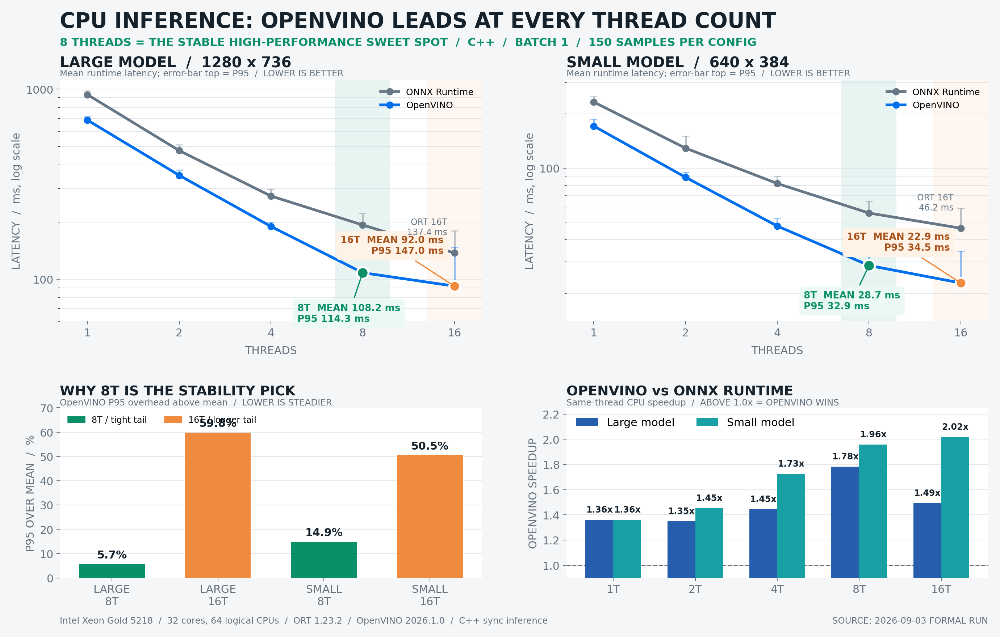

# 把一段交通视频摊开来看：VisionTrack 的架构与实现

道路视频检测真正困难的部分，不是让 YOLO 在一张图片上画出框，而是让一段视频在有限 CPU 资源上持续产生可信、可解释、可部署的结果。

每帧都运行高分辨率模型，精度基线清楚，但吞吐和延迟很快成为瓶颈；简单抽帧，车辆、行人和交通灯的轨迹又会在检测帧之间断开。异步推理还会带来另一个问题：模型返回的是过去某一帧的结果，系统必须把它校正到当前时间线，才能避免轨迹回跳。

VisionTrack 围绕这个工程矛盾展开：

- 用 YOLO26 完成图片和视频强检测；
- 用动态 stride 控制模型调用频率；
- 在跳过的帧上使用 LK 光流和 ByteTrack 续轨；
- 用高低分辨率模型协同处理速度与精度的取舍；
- 将训练环境与 C++ 部署环境分开；
- 通过 Drogon HTTP 接口、Web 工作台和 Qt 客户端交付结果。

项目当前面向 BDD100K 道路场景，识别人、车辆、交通灯和交通标志等 10 类目标。

本文运行说明于 2026-09-29 对照源码同步；带日期的性能数据为历史实验结果。

## 系统边界

开发环境中，浏览器首先访问 Vite。Vite 只代理推理请求，真正的 Gateway、API 和视频 worker 都位于同一个 **yolo_api** 进程中。curl 或其它客户端可以绕过 Vite，直接访问 Drogon 的 8080 端口。

~~~mermaid
flowchart LR
    Browser[Browser / React workbench]
    Client[curl / other client]
    Vite[Vite dev server UI and reverse proxy]

    subgraph Service[yolo_api process]
        Gateway[ApiGateway routes and limits]
        ImageAPI[Image handler]
        VideoAPI[Video handler]
        Temp[Temporary video]
        Jobs[VideoJobExecutor]
        Streams[RealtimeStreamManager]
        Shared[Shared InferenceScheduler]
        SSE[SSE events]
        CV[OpenCV preprocess]
        Scheduler[Dynamic scheduler]
        Worker[AsyncInferWorker in-process thread]
        Tracking[LK flow and trackers]
        Engine[YoloEngine ORT or OpenVINO]
        JSON[response_json]
    end

    Models[(Models, classes and config)]

    Browser --> Vite --> Gateway
    Client --> Gateway
    Gateway --> ImageAPI --> CV --> Engine
    Gateway --> VideoAPI --> Temp --> Jobs --> Scheduler
    Gateway --> Streams --> Shared --> Engine
    Streams --> SSE
    SSE --> Client
    Scheduler --> Worker --> Shared
    Scheduler --> Tracking
    Models --> Engine
    Engine --> JSON
    Tracking --> JSON
    JSON --> Gateway --> Browser
~~~

这里没有数据库、Redis、消息队列或向量库：

- 模型、类别文件和 YAML 配置是磁盘上的持久化输入；
- 上传视频会写入系统临时目录，请求结束后删除；
- 上传视频的帧、轨迹和结果属于单次请求，HTTP 响应后不保存可查询的任务结果；
- 实时流由 `/streams` 注册，独立于创建请求持续运行；每路保存跟踪状态及最多 256 条 SSE 事件，终态记录需要 DELETE 释放；
- 共享推理调度器、任务池和累计指标属于进程内状态，进程重启后不会恢复；
- **yolo_onnx_cpp/test_outputs/** 保存本地生成的大型运行产物；纳入版本管理的历史验证快照集中在 **docs/test-results/**。它们都不是在线数据库。

因此，Gateway 是进程内 HTTP 边界，不是独立微服务；Worker 是内存工作线程，也不是可恢复的队列消费者。

## 关键架构取舍

### 训练与部署环境分开

训练、验证和 ONNX 导出使用 **yolo** Conda 环境，可以使用 PyTorch 和 CUDA。在线服务使用 CMake、GCC15 和 **/root/vcpkg** 中的 Drogon、OpenCV、ONNX Runtime 或 OpenVINO，不依赖 Python 运行时。

仓库中的 **rag-api** 环境不参与 VisionTrack 推理链路。

### C++ CPU 推理基准结论

2026-09-03 使用同一套 C++ OpenCV 预处理、YoloEngine、decode 和 NMS，对 ONNX Runtime 1.23.2 与 OpenVINO 2026.1.0 进行了单实例、batch=1、同步 CPU 推理测试。两个后端读取相同 ONNX 权重；每个模型、后端和线程数组合采集 150 个正式样本，共 3000 个样本。

| 模型 | ONNX Runtime 最优 | OpenVINO 最优 | OpenVINO 相对优势 |
| --- | ---: | ---: | ---: |
| 1280 × 736 | 137.38 ms，16 线程 | 91.98 ms，16 线程 | 1.49x |
| 640 × 384 | 46.23 ms，16 线程 | 22.90 ms，16 线程 | 2.02x |

结论：

- CPU 单实例平均延迟优先选择 OpenVINO，并将 thread_num 设为 16；
- OpenVINO 16 线程波动更大。大模型 8 线程 P95 为 114.28 ms，优于 16 线程的 146.99 ms；需要更稳定尾延迟时，8 线程是更保守的候选；
- High/Low 双 Session 或多请求并发会竞争 CPU，生产配置应继续对 8、16 线程做并发吞吐验证，不能直接用单实例结论替代并发压测。

thread_num 在 C++ 中分别映射到 ONNX Runtime 的 SetIntraOpNumThreads 和 OpenVINO 的 ov::inference_num_threads。完整测试条件、大小模型明细和原始数据见 [C++ ONNX Runtime / OpenVINO 合并报告](docs/test-results/onnx_thread_benchmark/20260903_020914_utc/combined_report.md)。

### 强检测与弱跟踪分工

模型强检测负责重新确认类别和几何位置；光流只负责短间隔传播已有框；ByteTrack 负责轨迹 ID 和生命周期。稳定场景不必每帧调用模型，光流质量下降、尺度或速度突变时则提前触发强检测。

光流不是检测器，它只承担检测帧之间的时间连续性。

### 结构体先行，JSON 只出现在边界

推理过程使用 **InferResult**、**VideoFrameTracks** 和 **VideoInferResult** 等 C++ 结构体。上传视频在请求完成后由 **response_json.cpp** 生成响应；实时流通过同文件的 **realtimeFrameEventToJson** 逐事件序列化到 SSE。

### 上传视频等待完整响应，实时流持续输出

视频接口对调用方仍是同步 HTTP：客户端上传完整视频，等待处理完毕，再一次性接收 JSON。内部 **AsyncInferWorker** 可以并行执行强检测；旧帧结果返回时，系统先做运动补偿，再校正当前轨迹。

实时源则走 `/streams`：创建返回 201 后独立运行，通过 SSE 持续输出。当 `video_model_async=true` 且所需共享调度器可用时，单模型和高低模型都采用非阻塞推理、历史回放校正和当前帧光流；本地文件、关闭异步或缺少所需调度器时走同步回退。上传视频仍没有可查询的持久化 job API。

## 真实数据流

### 图片

~~~text
multipart image
-> ApiGateway
-> ImageInferenceHandler
-> OpenCV decode and letterbox
-> NCHW float tensor
-> YoloEngine
-> InferResult
-> response_json
-> HTTP JSON
~~~

图片请求不会创建后台任务。响应包含检测框、输出 shape、阶段耗时、CPU 利用率和 RSS 内存。

### 普通视频

~~~text
multipart video
-> temporary file
-> bounded VideoJobExecutor
-> OpenCV VideoCapture
-> calculate base stride
-> LK optical flow on readable frames
-> schedule model detection when due or quality degrades
-> compensate completed async detections
-> update ByteTrack
-> interpolate only when no tracking result is usable
-> collect VideoInferResult
-> serialize one HTTP response
-> delete temporary file
~~~

以 24 FPS 视频和目标检测帧率 4 FPS 为例，基础 stride 是 6。稳定阶段大约每 6 帧调度一次模型；复杂运动或光流质量下降时，动态策略会缩短间隔。

每帧通过 **tracks_source** 说明来源：

- **async_corrected**：异步模型结果已经过时间补偿；
- **detected**：同步或兼容路径的强检测结果；
- **weak_tracked**：使用 LK 光流传播；
- **interpolated**：相邻检测帧之间的插值兜底；
- **empty**：没有可用结果。

### 高低分辨率协同

**/infer_video_high_low** 使用高分辨率模型维护权威状态，低分辨率模型承担更频繁的轻量刷新。AuthorityTracker 在 high-res、low-res、flow 及异步 replay 后更新 stable、provisional、去重和生命周期状态。

2026-07-10 三场景伪标签回归中，pooled precision 从 0.5048 提高到 0.7249，F1 从 0.6384 提高到 0.7726，FP 减少约 63%。完整记录见 [优化计划](docs/reports/优化计划.md) 和 [视频算法对比报告](docs/reports/video_algorithm_comparison_20260710.md)。

预测视频：[dynamic_onnx_flow_detections.mp4](Readme/dynamic_onnx_flow_detections.mp4)。

## 当前工作台

截图由当前 **front/** 代码正式构建后，在 1440 × 900 视口生成，使用内置 BDD100K Demo replay。它展示的是真实界面状态，但不是一次真实 Drogon 响应，因此明确标记了 Demo、Not checked 和 not reported。

界面可以观察：

- endpoint、multipart 字段和请求状态；
- 强检测、跳帧、光流、动态 stride、ByteTrack 和 JSON 节点；
- 当前帧目标框、类别、置信度与结果来源；
- 轨迹生命周期和可见状态；
- 模型、光流、跟踪及端到端指标；
- 当前响应未提供的字段，而不是前端生成的虚构数据。

前端当前调用 **/infer** 和 **/infer_video**。High/Low endpoint 已由后端提供，但尚未加入工作台模式选择。

## 状态、可观测性与失败语义

上传接口和实时流有不同的结束边界：

- `/infer` 和两个上传视频接口一次性返回 JSON；成功响应的 `code` 为 0。上传连接重试会重新计算，没有幂等键或任务续算。
- `/streams/{id}/events` 使用 SSE，普通事件为 `detection`、终止事件为 `end`；每条结果包含递增的事件 ID。光流帧也使用 `detection` 名称。
- 携带 `Last-Event-ID` 可以补发该流内存缓存中游标之后的事件，再接收新事件。缓存最多 256 条，游标过旧或超前会收到 `error` 并关闭；不支持进程重启后的恢复，也没有 WebSocket 路由。
- 上传、媒体或参数错误通常返回 400，模型或内部异常返回 500；开启门禁后有 401/429，上传任务池满返回 503，实时流重复 ID 或注册容量满返回 409。

应用结构化日志采用字段白名单：上传日志关联 request ID、route、stream ID、状态码与性能计数，不记录上传文件名或原始异常文本；流日志不记录源地址。响应中的 timing、metrics 和 high_low_diagnostics 提供请求诊断，`/metrics` 提供流、调度器、任务池与门禁的 Prometheus 指标。

~~~bash
curl -i http://127.0.0.1:8080/health
curl -i http://127.0.0.1:8080/ready
~~~

`/health` 返回 `{"status":"ok"}`，`/ready` 只检查流管理器是否存在；两者免鉴权和限流，不能证明摄像头连通或业务推理质量。`/metrics` 仍受门禁约束。

## 最短运行路径

以下路径假设 **/root/vcpkg** 已按仓库约束准备好。项目没有 .env、数据库初始化或一键整栈脚本。

### 1. 确认本地模型

项目不会自动下载权重：

~~~bash
ls -lh yolo_onnx_cpp/deploy/best.onnx yolo_onnx_cpp/deploy/best_640x384.onnx yolo_onnx_cpp/deploy/classes.json
~~~

### 2. 构建并启动后端

~~~bash
cd yolo_onnx_cpp
cmake --preset vcpkg-gcc15-release
cmake --build --preset vcpkg-gcc15-release
../build/yolo_api config.yaml
~~~

服务监听 0.0.0.0:8080，日志直接输出到终端。项目不创建 PID 文件或固定日志目录；使用 Ctrl-C 停止。

### 3. 安装并启动前端

在另一个终端运行：

~~~bash
cd front
npm ci
npm run dev -- --host 0.0.0.0
~~~

Vite 默认代理图片和视频接口到 127.0.0.1:8080。连接其它后端时使用：

~~~bash
VITE_API_BASE_URL=http://127.0.0.1:8080 npm run dev -- --host 0.0.0.0
~~~

前后端分别运行在两个前台终端，可以独立使用 Ctrl-C 重启或停止。当前没有统一 PID、日志和服务编排脚本。

### 4. 直接验证 API

~~~bash
curl -X POST http://127.0.0.1:8080/infer -F "image=@/path/to/image.jpg"

curl -X POST "http://127.0.0.1:8080/infer_video?include_frames=false" -F "video=@/path/to/video.mp4"
~~~

在线请求不写数据库；视频只会短暂写入系统临时目录。训练、导出和对比脚本会写入 runs、deploy 或显式输出目录，执行前应单独确认。

## 代码分层

~~~text
front/                         React 工作台、HTTP client 和 Demo replay
model/                         YOLO26 训练、BDD100K 工具和 ONNX 导出
yolo_onnx_cpp/
  main.cpp                     配置、模型加载和启动
  config/                      YAML 配置解析
  drogon/api_contract.h        路由与上传字段契约
  drogon/api_gateway.*         路由注册、监听和请求限制
  drogon/inference_handlers.*  图片和视频 HTTP 编排
  drogon/realtime_stream_handlers.*  实时流 CRUD、SSE、健康与指标接口
  drogon/video_job_executor.*  上传视频有界任务池
  drogon/request_gate.*        Bearer 鉴权与按客户端 IP 限流
  drogon/request_utils.*       查询参数和临时文件
  drogon/response_json.*       外部 JSON schema
  image/                       解码、letterbox、tensor 和输出解析
  model/                       ONNX Runtime / OpenVINO 推理与共享调度器
  stream/                      实时解码、异步回放、检测节奏和流生命周期
  video/                       调度、worker、光流和 High/Low
  tracking/                    ByteTrack 与 AuthorityTracker
  metrics/                     延迟、CPU、内存和队列指标
  test_cpp/                    C++ 回归测试
qt_ui/                         不经过 HTTP 的本地 Qt 图片客户端
docs/                          文档索引、正式报告、测试快照和截图资源
~~~

推荐阅读顺序：**main.cpp → api_gateway.cpp → inference_handlers.cpp → video_inference.cpp → video_inference_detail.cpp → optical_flow_tracker.cpp / byte_tracker.cpp → yolo_engine.cpp**。

## 常用 API

| Method | Path | 上传字段 | 用途 |
| --- | --- | --- | --- |
| POST | /infer | image | 单张图片检测 |
| POST | /infer_video | video | 动态 stride、异步强检测、光流和 ByteTrack |
| POST | /infer_video_high_low | video | 高低分辨率协同与 AuthorityTracker |
| POST | /streams | JSON: stream_id、source | 注册实时流，返回 201 |
| GET | /streams、/streams/{id} | — | 流列表与状态 |
| DELETE | /streams/{id} | — | 停止并释放注册名额 |
| GET | /streams/{id}/events | — | SSE，可带 Last-Event-ID 补发缓存事件 |
| GET | /health、/ready | — | 存活与就绪检查 |
| GET | /metrics | — | Prometheus 指标 |

视频接口支持：

- **include_frames=false**：只返回摘要和指标；
- **frame_offset=N**：从第 N 个结果帧开始；
- **frame_limit=N**：最多返回 N 帧，必须为正整数。

这些参数只裁剪响应序列化范围，不会减少已经完成的视频推理工作。完整字段以 [response_json.cpp](yolo_onnx_cpp/drogon/response_json.cpp) 和 [Gateway 契约测试](yolo_onnx_cpp/test_cpp/api_gateway_contract_test.cpp) 为准。

## 模型训练与导出

训练环境规格位于 **envs/yolo.yml**：

~~~bash
conda env create -f envs/yolo.yml
conda run -n yolo python -m pip check
~~~

**model/train.py** 保留已设置的 `CUDA_VISIBLE_DEVICES`；未设置时默认暴露物理 GPU 4、5。默认 `--device auto` 使用第一张可见 GPU，无 CUDA 时回退 CPU；双卡训练需显式指定 `--device 0,1`。训练分为 `base`、`hard`、`distill` 阶段，具体参数见 `--help`：

~~~bash
conda run -n yolo python model/train.py
~~~

导出不会由服务自动触发：

~~~bash
conda run -n yolo python model/onnx.py --pt /path/to/local/best.pt --data model/data/bdd100k_yolo_det/data.yaml --imgsz 384 640 --deploy-dir /path/to/new-export
~~~

导出尺寸参数顺序为高、宽；高模型应显式使用 `--imgsz 736 1280`。导出默认使用 opset 13，并进行 INT8 校准；仅导出 FP32 时加 `--skip-int8`。输出目录使用新路径，脚本拒绝覆盖已有导出文件。

当前 YOLO26 ONNX 输出为 **output0(1, 300, 6)**，每行按 **x1, y1, x2, y2, score, class_id** 解析。解码器同时保留旧 YOLO 原始候选输出的兼容路径。

## 验证

~~~bash
cd yolo_onnx_cpp
cmake --preset vcpkg-gcc15-release
cmake --build --preset vcpkg-gcc15-release
ctest --preset vcpkg-gcc15-release

cd ../front
npm run build
~~~

CTest 覆盖配置、图片处理、跟踪、共享调度、实时流生命周期、异步回放、SSE 补发、Gateway 契约及相关 Python 工具。训练质量管线可另用 `conda run -n yolo python model/test_training_quality_pipeline.py` 验证。

历史报告和已纳入版本管理的验证结果统一从 [docs 文档索引](docs/README.md) 查阅。新的测试运行仍写入 **yolo_onnx_cpp/test_outputs/**，不会覆盖文档快照。

环境检查：

~~~bash
conda run -n yolo python -m pip check
conda run -n rag-api python -m pip check
bash qt_ui/check_env.sh
~~~

Qt 检查失败时应阅读输出；不要改用系统 Qt，也不要在 qt_ui 下生成独立 vcpkg_installed。

## 当前限制与开放问题

1. **上传视频仍等待完整结果。** 长视频默认响应和逐帧结果占用可能较大；摘要模式只减少响应大小。
2. **没有任务持久化。** 实时 SSE 仅在同一流的有限内存缓存内补发；进程重启、记录删除或历史淘汰后不能恢复。
3. **健康检查不做业务自测。** 就绪不代表摄像头连通、吞吐达标或精度合格。
4. **Web 工作台尚未接入 High/Low 模式和实时流管理。**
5. **YOLO26 端到端输出后仍执行兼容 NMS。** 是否跳过需要场景回归证据。
6. **性能结论有实验边界。** 2026-07-10 伪标签回归的 weak-tracked mean IoU 为 0.8614、pooled FPS 为 24.71，分别未达当时 0.88/28 的目标；它们不是当前多路版本的性能结论。后续本地多路长测见[实施记录](docs/reports/多路实时监测实施记录_20260905.md)，真实 RTSP、业务质量和生产闭环仍需验收。

完整调用链、实时异步分支与 SSE 补发语义见[初始化到多 IP 任务提交完整流程](docs/reports/初始化到多IP任务提交完整流程.md)。
